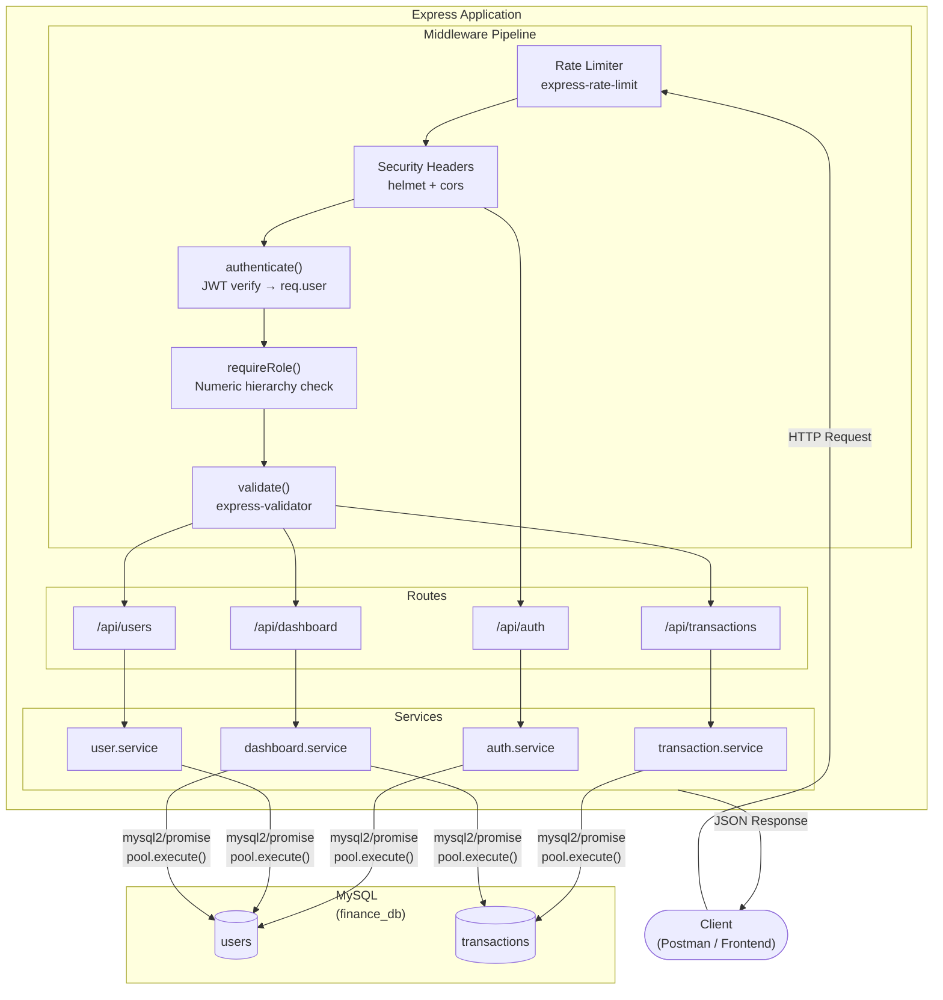
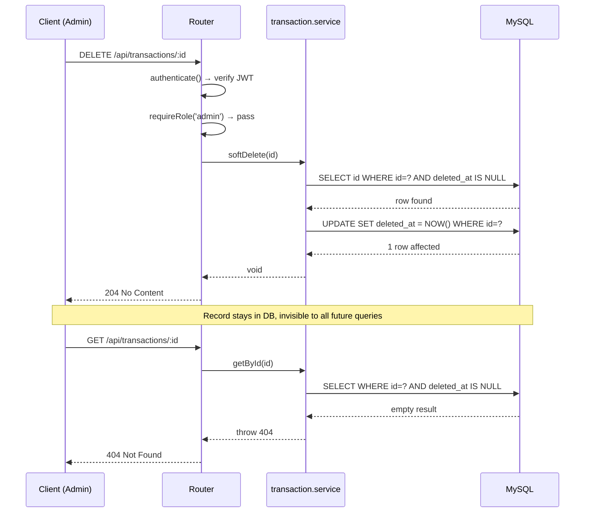

<div align="center">

# Finance Data Processing & Access Control Backend

*A clean, production-ready REST API backend for a **Finance Dashboard System** supporting role-based access control, financial record management, and summary-level analytics.*

[](https://nodejs.org/)
[](https://expressjs.com/)
[](https://www.mysql.com/)

**[Live Demo](https://finance-backend-do8r.onrender.com)**

</div>

---

## Table of Contents

1. [Tech Stack](#tech-stack)
2. [System Architecture](#system-architecture)
3. [Setup & Run](#setup--run)
4. [Project Structure](#project-structure)
5. [Database Schema](#database-schema)
6. [API Documentation](#api-documentation)
7. [Role Permission Matrix](#role-permission-matrix)
8. [Error Handling](#error-handling)
9. [Design Decisions & Assumptions](#design-decisions--assumptions)
10. [Security Measures](#security-measures)
11. [Optional Enhancements Implemented](#optional-enhancements-implemented)
12. [License](#license)
13. [Contact](#contact)

---

## Tech Stack

| Layer | Choice | Reason |
|---|---|---|
| Runtime | Node.js | Ubiquitous, fast for I/O-bound work |
| Framework | Express.js | Minimal, flexible, widely understood |
| Database | MySQL via `mysql2/promise` | Relational model fits financial data; async-first driver |
| Auth | JWT (`jsonwebtoken`) | Stateless, self-contained tokens; easy to inspect |
| Hashing | `bcryptjs` | Industry-standard password hashing with configurable rounds |
| Validation | `express-validator` | Declarative, chainable, field-level rules |
| Security | `helmet` + `express-rate-limit` | HTTP header hardening + brute-force protection |

---

## System Architecture



### Request Lifecycle

1. **Rate Limiter** — every request is counted per IP. Auth endpoints are throttled more aggressively (20 req / 15 min) than general routes (300 req / 15 min).
2. **Security Headers** — `helmet` sets secure HTTP headers; `cors` allows cross-origin requests.
3. **`authenticate()` middleware** — verifies the `Bearer` token, loads the matching user row from MySQL, and attaches it to `req.user`. Public routes (`/api/auth/register`, `/api/auth/login`, `/health`) bypass this step.
4. **`requireRole()` middleware** — compares the user's numeric role level against the route's minimum requirement. Returns `403` immediately if insufficient.
5. **`validate()` middleware** — runs the `express-validator` rule chains for the route. Returns `422` with field-level details on failure.
6. **Route handler** — calls the appropriate service function with validated, typed inputs.
7. **Service layer** — contains all business logic. Issues parameterised SQL queries via the `mysql2` connection pool.
8. **MySQL** — executes queries and returns result sets. `updated_at` is managed automatically via `ON UPDATE CURRENT_TIMESTAMP`.
9. **JSON response** — the service result is serialised and returned to the client with the appropriate HTTP status code.

### Data Flow — Soft Delete



---

## Project Structure

```
finance-backend/
├── src/
│   ├── app.js                            # Entry point — Express setup, middleware, routing
│   ├── config/
│   │   └── database.js                   # MySQL pool, schema initialisation, admin seed
│   ├── middleware/
│   │   ├── auth.js                       # JWT verification → populates req.user
│   │   ├── rbac.js                       # Role-based access guard (requireRole)
│   │   └── validate.js                   # express-validator error formatter
│   ├── routes/
│   │   ├── auth.routes.js                # POST /register, POST /login, GET /me
│   │   ├── users.routes.js               # User CRUD + role/status management
│   │   ├── transactions.routes.js        # Transaction CRUD with filtering
│   │   └── dashboard.routes.js           # Summary analytics endpoints
│   ├── services/
│   │   ├── auth.service.js               # register / login / getMe
│   │   ├── user.service.js               # User business logic
│   │   ├── transaction.service.js        # Transaction business logic + soft delete
│   │   └── dashboard.service.js          # Aggregated analytics queries
│   └── validators/
│       ├── auth.validator.js             # Register / login validation rules
│       ├── user.validator.js             # User update / role / status rules
│       └── transaction.validator.js      # Transaction create / update / list query rules
├── seed.js                               # Demo data seeder (run once after first server start)
├── .env                                  # Environment variables
├── package.json                          # Exact-pinned dependencies, no ^ or ~
├── .gitignore                            # Git ignore rules
├── README.md                             # This file
└── License                               # MIT License    
```

---

## Setup & Run

Follow these steps to run the project locally.

### Prerequisites

- **Node.js >= 18** (LTS recommended)
- **npm >= 9**
- **MySQL Server** running locally or via cloud

### 1. Clone the Repository

```bash
git clone https://github.com/SreejitBakshi10/finance-backend.git
```

### 1. Install dependencies

```bash
cd finance-backend
npm install
```

### 2. Configure environment

Create a `.env`:

```env
PORT=3000

# MySQL connection
DB_HOST=localhost
DB_PORT=3306
DB_USER=root
DB_PASSWORD=your_mysql_password   # ← your actual MySQL password
DB_NAME=finance_db

# Auth
JWT_SECRET=replace_with_a_long_random_string   # ← must change before use
JWT_EXPIRES_IN=7d
BCRYPT_ROUNDS=10
```

> `JWT_SECRET` should be a long, random string (minimum 32 characters) in any shared environment.

### 3. Start the server

```bash
npm run dev     # auto-restarts on file changes (nodemon)
```

On **first run**, the server automatically:
1. Creates the `finance_db` MySQL database if it does not exist
2. Creates the `users` and `transactions` tables
3. Seeds a default **admin** account

```
Email: admin@finance.local
Password: Admin@1234
```

### 4. Seed demo data (optional but recommended)

After the server has run at least once (tables must exist):

```bash
node seed.js
```

This inserts:
- 2 additional users (analyst + viewer)
- ~132 realistic transactions spread across 12 months
- 5 soft-deleted transactions (to verify deleted_at filtering)

**Credentials after seeding:**

| Email | Password | Role |
|---|---|---|
| admin@finance.local | Admin@1234 | admin |
| priya@finance.local | Demo@1234 | analyst |
| ravi@finance.local | Demo@1234 | viewer |

The seeder is **idempotent** — running it twice skips existing users and skips transaction
insertion if rows already exist.

### 5. Verify

```bash
curl http://localhost:3000/health
# → {"status":"ok","timestamp":"..."}
```

---

## Database Schema

```sql
-- Users
CREATE TABLE users (
  id VARCHAR(36) PRIMARY KEY, -- UUID v4
  name VARCHAR(255) NOT NULL,
  email VARCHAR(255) UNIQUE NOT NULL,
  password VARCHAR(255) NOT NULL, -- bcrypt hash
  role ENUM('viewer', 'analyst', 'admin') NOT NULL DEFAULT 'viewer',
  status ENUM('active', 'inactive') NOT NULL DEFAULT 'active',
  created_at TIMESTAMP NOT NULL DEFAULT CURRENT_TIMESTAMP,
  updated_at TIMESTAMP NOT NULL DEFAULT CURRENT_TIMESTAMP ON UPDATE CURRENT_TIMESTAMP
);

-- Transactions
CREATE TABLE transactions (
  id VARCHAR(36) PRIMARY KEY, -- UUID v4
  amount DECIMAL(15, 2) NOT NULL CHECK (amount > 0),
  type ENUM('income', 'expense') NOT NULL,
  category VARCHAR(100) NOT NULL,
  date DATE NOT NULL,
  description TEXT,
  created_by VARCHAR(36) NOT NULL,
  deleted_at TIMESTAMP NULL DEFAULT NULL, -- NULL = active
  created_at TIMESTAMP NOT NULL DEFAULT CURRENT_TIMESTAMP,
  updated_at TIMESTAMP NOT NULL DEFAULT CURRENT_TIMESTAMP ON UPDATE CURRENT_TIMESTAMP,
  INDEX idx_tx_type (type),
  INDEX idx_tx_category (category),
  INDEX idx_tx_date (date),
  INDEX idx_tx_deleted (deleted_at),
  FOREIGN KEY (created_by) REFERENCES users (id)
);
```

**Valid categories:** `salary` · `freelance` · `investment` · `food` · `utilities` ·
`entertainment` · `healthcare` · `transport` · `education` · `other`

---

## Role Permission Matrix

| Endpoint / Action | Viewer | Analyst | Admin |
|---|:---:|:---:|:---:|
| `POST /api/auth/register` | ✓ | ✓ | ✓ |
| `POST /api/auth/login` | ✓ | ✓ | ✓ |
| `GET /api/auth/me` | ✓ | ✓ | ✓ |
| `GET /api/dashboard/summary` | ✓ | ✓ | ✓ |
| `GET /api/dashboard/recent-activity` | ✓ | ✓ | ✓ |
| `GET /api/dashboard/categories` | ✗ | ✓ | ✓ |
| `GET /api/dashboard/trends/monthly` | ✗ | ✓ | ✓ |
| `GET /api/dashboard/trends/weekly` | ✗ | ✓ | ✓ |
| `GET /api/transactions` | ✗ | ✓ | ✓ |
| `GET /api/transactions/:id` | ✗ | ✓ | ✓ |
| `POST /api/transactions` | ✗ | ✓ | ✓ |
| `PUT /api/transactions/:id` | ✗ | ✓ | ✓ |
| `DELETE /api/transactions/:id` (soft) | ✗ | ✗ | ✓ |
| `GET /api/users` | ✗ | ✗ | ✓ |
| `GET /api/users/:id` | self only | self only | ✓ |
| `PUT /api/users/:id` | self only | self only | ✓ |
| `PATCH /api/users/:id/role` | ✗ | ✗ | ✓ |
| `PATCH /api/users/:id/status` | ✗ | ✗ | ✓ |
| `DELETE /api/users/:id` | ✗ | ✗ | ✓ |

Role enforcement is implemented as a reusable middleware (`requireRole`) using a numeric hierarchy
(`viewer=0`, `analyst=1`, `admin=2`). A higher-level role automatically satisfies lower-level
requirements — `requireRole('analyst')` passes for both analyst and admin.

---

## API Documentation

All protected endpoints require:

```
Authorization: Bearer <token>
```

---

### Authentication — `/api/auth`

#### Register a new user
```
POST /api/auth/register
Content-Type: application/json

{
    "name": "Jane Doe",
    "email": "jane@example.com",
    "password": "Secret@99",
    "role": "analyst" // optional — defaults to "viewer"
}
```
Response `201`:
```json
{
    "user": {
        "id": "...",
        "name": "Jane Doe",
        "email": "...",
        "role": "analyst",
        "status": "active",
        "created_at": "..."
    },
    "token": "eyJ..."
}
```

#### Login
```
POST /api/auth/login
Content-Type: application/json

{
    "email": "jane@example.com",
    "password": "Secret@99"
}
```
Response `200`: same shape as register.

#### Get current user
```
GET /api/auth/me
Authorization: Bearer <token>
```

---

### Transactions — `/api/transactions`

#### List transactions
```
GET /api/transactions
```

| Query param | Type | Default | Description |
|---|---|---|---|
| `page` | int | 1 | Page number |
| `limit` | int (max 100) | 20 | Items per page |
| `type` | string | — | `income` or `expense` |
| `category` | string | — | Any valid category |
| `from` | date (ISO 8601) | — | Start date filter |
| `to` | date (ISO 8601) | — | End date filter |
| `search` | string | — | Full-text search in description |
| `sortBy` | string | `date` | `date`, `amount`, `category`, `created_at` |
| `order` | string | `desc` | `asc` or `desc` |

Response `200`:
```json
{
    "data": [
        {
            "id": "...",
            "amount": "800.00",
            "type": "expense",
            "category": "food",
            "date": "2025-03-15",
            "description": "Grocery shopping",
            "created_by": "...",
            "created_by_name": "Priya Analyst",
            "deleted_at": null,
            "created_at": "...",
            "updated_at": "..."
        }
    ],
    "meta": {
        "total": 48,
        "page": 1,
        "limit": 5,
        "pages": 10
    }
}
```

#### Get single transaction
```
GET /api/transactions/:id
```

#### Create transaction
```
POST /api/transactions
Content-Type: application/json

{
    "amount": 1500.00,
    "type": "income",
    "category": "salary",
    "date": "2025-04-01",
    "description": "April salary" // optional, max 500 characters
}
```

#### Update transaction
```
PUT /api/transactions/:id
Content-Type: application/json

{
    "amount": 1600.00,
    "description": "Updated description"
}
```
All fields are optional — only provided fields are updated.

#### Soft delete transaction *(admin only)*
```
DELETE /api/transactions/:id
```
Returns `204 No Content`. The record is **not physically removed** — `deleted_at` is set to the
current timestamp. All list and detail queries filter by `deleted_at IS NULL`, making the record
invisible to the entire API.

---

### Dashboard — `/api/dashboard`

#### Summary *(all roles)*
```
GET /api/dashboard/summary
```
```json
{
    "total_income": 725400.50,
    "total_expenses": 312800.75,
    "net_balance": 412599.75,
    "total_transactions": 132
}
```

#### Recent activity *(all roles)*
```
GET /api/dashboard/recent-activity?limit=10
```
Returns the most recent `limit` transactions (max 50). Useful for a live feed widget.

#### Category totals *(analyst+)*
```
GET /api/dashboard/categories?type=expense
```
```json
[
    {
        "category": "food",
        "type": "expense",
        "total": 42000.00,
        "count": 32
    },
    {
        "category": "transport",
        "type": "expense",
        "total": 18500.00,
        "count": 21
    }
]
```
`type` filter is optional — omitting it returns both income and expense categories.

#### Monthly trends *(analyst+)*
```
GET /api/dashboard/trends/monthly?months=12
```
```json
[
    {
        "month": "2024-05",
        "income": 52000.00,
        "expenses": 28400.00,
        "net": 23600.00
    },
    {
        "month": "2024-06",
        "income": 48500.00,
        "expenses": 31200.00,
        "net": 17300.00
    }
]
```
`months` defaults to 12, maximum 24.

#### Weekly trends *(analyst+)*
```
GET /api/dashboard/trends/weekly?weeks=8
```
Same shape with a `week` field in ISO week format (`2025-W14`). `weeks` defaults to 8, maximum 52.

---

### Users — `/api/users` *(admin only unless noted)*

#### List users
```
GET /api/users?page=1&limit=20&role=analyst&status=active&search=jane
```
Supports the same pagination meta as transactions.

#### Get user *(admin or self)*
```
GET /api/users/:id
```

#### Update user name / email *(admin or self)*
```
PUT /api/users/:id
Content-Type: application/json

{
    "name": "Jane Smith",
    "email": "janesmith@example.com"
}
```

#### Update role *(admin only)*
```
PATCH /api/users/:id/role
Content-Type: application/json

{
    "role": "analyst"
}
```

#### Update status *(admin only)*
```
PATCH /api/users/:id/status
Content-Type: application/json

{
    "status": "inactive"
}
```
Setting a user to `inactive` immediately blocks their token on the next request.

#### Delete user *(admin only)*
```
DELETE /api/users/:id
```
Returns `204 No Content`. An admin cannot delete their own account (returns `400`).

---

## Error Handling

All errors return a consistent JSON envelope:

```json
{
    "error": "Human-readable message"
}
```

Validation errors (`422`) include field-level detail:

```json
{
    "error": "Validation failed",
    "details": [
        {
            "field": "amount",
            "message": "Amount must be a positive number"
        },
        {
            "field": "date",
            "message": "Date must be a valid ISO 8601 date (YYYY-MM-DD)"
        }
    ]
}
```

| HTTP Status | Meaning |
|---|---|
| `200` | OK |
| `201` | Created |
| `204` | No Content (successful delete) |
| `401` | Unauthenticated — missing, expired, or invalid token |
| `403` | Forbidden — valid token but insufficient role, or inactive account |
| `404` | Resource not found (or soft-deleted) |
| `409` | Conflict — duplicate email on register or update |
| `422` | Validation error — see `details` array |
| `429` | Rate limit exceeded |
| `500` | Internal server error |

---

## Design Decisions & Assumptions

1. **Auto-creates the database** — `initializeDatabase()` opens a temporary connection without
   specifying a database, runs `CREATE DATABASE IF NOT EXISTS finance_db`, then switches to the
   main pool. No manual SQL setup required by the reviewer.

2. **`mysql2/promise` (async-first)** — all services and routes use `async/await`. `LIMIT` and
   `OFFSET` are interpolated into the query string rather than passed as `?` placeholders, because
   MySQL's binary prepared-statement protocol rejects JavaScript numbers in those positions.
   User-supplied filter values (type, category, search, dates) remain fully parameterised.

3. **Soft delete on transactions** — `deleted_at IS NULL` is applied to every read query.
   Financial records should never be physically removed; they must remain auditable. Deleted
   records are invisible to all API responses but remain in the database.

4. **`ON UPDATE CURRENT_TIMESTAMP`** — MySQL handles `updated_at` automatically on every `UPDATE`
   statement. No manual timestamp management is needed in any service.

5. **Viewers are restricted from raw transaction data** — they may only access dashboard summary
   totals and recent activity. The rationale: a "viewer" in a finance system typically maps to an
   executive or stakeholder who needs high-level numbers, not individual line items.

6. **Analysts can create and update transactions** — they are assumed to be active finance team
   members entering data, not just readers.

7. **Role hierarchy** — `viewer=0, analyst=1, admin=2`. `requireRole('analyst')` passes for both
   analyst and admin via a single numeric comparison, keeping route declarations clean.

8. **JWT-only auth (no refresh token)** — kept intentionally simple for assessment scope. In
   production, a short-lived access token paired with a rotating refresh token would be used.

9. **Password policy** — minimum 8 characters, at least one uppercase letter, at least one digit.
    Enforced at registration via `express-validator`.

10. **Exact dependency pinning** — every dependency in `package.json` uses an exact version
    (no `^` or `~`) to prevent unintended upgrades. The `overrides.axios` field pins the
    transitive version to `1.14.0` as a security safeguard against the supply chain compromise
    in `1.14.1` / `0.30.4`.

---

## Security Measures

| Measure | Implementation |
|---|---|
| HTTP header hardening | `helmet` middleware on all routes |
| Auth brute-force protection | `express-rate-limit` — 20 requests / 15 min on `/api/auth/*` |
| Global rate limiting | 300 requests / 15 min across all routes |
| Password hashing | `bcryptjs` with configurable rounds (default 10) |
| Token verification | `jsonwebtoken` — invalid/expired tokens return `401` |
| Inactive account blocking | Checked on every authenticated request in `auth.js` middleware |
| SQL injection prevention | All user inputs passed as `mysql2` parameterised `?` placeholders |
| Input validation | `express-validator` with strict type/enum/length/format rules |
| Dependency security | Exact version pinning + `overrides` block for Axios |

---

## Optional Enhancements Implemented

### Authentication using tokens
JWT-based authentication is fully implemented. Every protected route requires a `Bearer` token in the `Authorization` header. Tokens are signed with `HS256`, carry the user ID as the `sub` claim, and expire after a configurable duration (`JWT_EXPIRES_IN`, default `7d`). Invalid, expired, or tampered tokens are rejected with `401`. Inactive accounts are blocked at the middleware level even if the token is valid.

### Pagination for record listing
Both `/api/transactions` and `/api/users` support cursor-free **offset pagination** via `page` and `limit` query parameters. Every paginated response includes a `meta` envelope:
```json
{
    "total": 132,
    "page": 2,
    "limit": 20,
    "pages": 7
}
```
The `limit` parameter is capped at 100 to prevent runaway queries.

### Search support
Transaction listing supports a `search` query parameter that performs a `LIKE` match against the `description` field:
```
GET /api/transactions?search=grocery
```
User listing supports a `search` parameter that matches against both `name` and `email` fields:
```
GET /api/users?search=priya
```

### Soft delete functionality
Transactions are never physically removed from the database. `DELETE /api/transactions/:id` sets `deleted_at` to the current timestamp. Every read query — list, single fetch, aggregations, dashboard analytics — applies `WHERE deleted_at IS NULL`, making soft-deleted records completely invisible to the API while keeping them auditable in the database.

### Rate limiting
Two tiers of rate limiting are applied using `express-rate-limit`:
- **Auth endpoints** (`/api/auth/*`) — 20 requests per 15 minutes per IP, to throttle brute-force login attempts.
- **All routes globally** — 300 requests per 15 minutes per IP as a general abuse safeguard.
Both tiers return a clear `429` JSON error response when the limit is exceeded.

---

## License

This project is licensed under the **MIT License** - see the [LICENSE](LICENSE) file for details.

---

## Contact

**Sreejit Bakshi**

[](https://github.com/SreejitBakshi10)
[](https://www.linkedin.com/in/sreejit-bakshi-156133324)